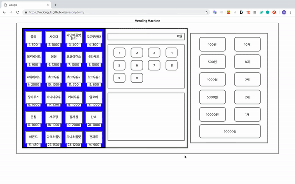
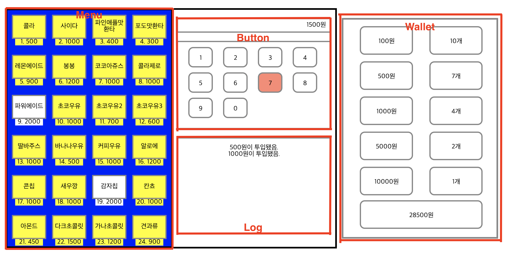
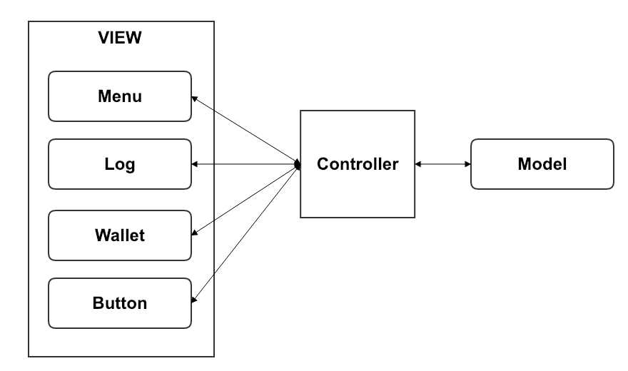

# MVC패턴을 적용한 웹자판기 프로젝트

## Demo & TestCode Review

* [Demo](https://imdonguk.github.io/javascript-vm/)

* [TestCode Review](./testcode_review.md)

## introdution

* 실제 동작하는 자판기의 동작을 웹으로 구현
* javascript(ES6), HTML, CSS만을 사용

### 주요특징

* View나 Model을 모듈단위로 분리
* view와 view, model과 view간의 의존하지않기 위해서 MVC패턴 적용
* 프레임워크나 라이브러리없이 vanillajs를 사용
* node환경의 테스트라이브러리 jest와 트랜스파일라이브러리 babel사용경험
* UI테스트코드와 MVC구조의 테스트코드작성 경험

### 프로젝트 설명

* Wallet UI에서 금액을 클릭한다.(자판기에 돈 투입)
  * 구입가능한 메뉴는 배경색이 노란색으로 바뀐다.
  * Button부분에 투입금액이 나타난다.
  * 금액이 투입됐다고 Log에 나타난다.
* Button UI에서 원하는 메뉴의 번호를 click한다.(메뉴선택)
  * 선택된 메뉴가 Log에 나타나고, Button의 투입금액이 차감된다.
  * 3초동안 동작이 없을 땐 돈이 반환되고, 반환되었다는 Log가 나타난다.

## 설계 및 다이어그램

### 다이어그램

### 설계전 고민

가장 큰 고민은 각 모듈끼리의 의존관계를 끊는 것이었다. 처음에는 이해가 가질 않았다. 

자판기에 돈을 투입하면 Menu클래스의 UI가 변하고 Log클래스에 메시지나 노출되며, 

지갑의 돈은 줄어들고 자판기에 투입금액은 증가했다.

서로 의존을 할 수 밖에 없는데 어떻게 해야할 지 몰랐다.

고민하고, 방법을 찾아보다가 중간에 계층을 둬야된다는 말의 뜻을 이해하고 프로젝트 설계를 시작했다.

### 설계

* 각각의 클래스의 역할정의를 명확하게 하기.

* 각각의 클래스들의 의존관계를 끊기위해서 중간계층인 Controller를 두어서 MVC패턴적용

  해당 view의 동작이 다른 view의 영향을 준다하더라도 그 해당view의 동작만 수행하도록하고,

  뭔지 모를 afterAction을 동작하게 하고, afterAction의 세부동작은 Controller에서 정의한다.

* 설계는 함수명을 짓는 것부터가 시작
  * 함수명과 함수의 동작이 완전히 일치해야한다.
  * 한개의 함수에서 여러동작이 일어나지않는다.

* Model클래스와 같은 Property의 변화가 있을 때는 함수( 메서드 )를 통해 변화를 주어야한다.

## Development

모든 코드의 구현을 설명하기는 어렵고, 구현에 있어서 가장 중요하게 다뤘던 코드를 설명하겠다.

### 서로 영향을 주는 UI, 하지만 서로 의존하지 않는 실제 코드에서의 클래스

클래스 간의 관계를 느슨하게 하기 위해서 Controller라는 계층을 두었다.

~~~js
//WalletView.js

export default class WalletView {

  constructor(delayTime) {
    this.inputMoneyHandler = null;
    this.returnMoneyHandler = null;
    this.insertCoinHandler = null;
    this.showNoMoneyHandler = null;
    this.delayReturnMoneyId = 0;
    this.delayTime = delayTime;
    this.clickCoinBtns();
  }
~~~

WalletView에서 금액을 click할 때 ( 자판기의 돈을 투입했을 때 ) 일어나는 afterAction이다. afterAction은 inputMoneyHandler, returnMoneyHandler, insertCoinHandler, showNoMoneyHandler등이 있다. 

click 했을 때 저런 동작이 모두 일어나지만 같은 클래스에 모두 구현하기에는 클래스가 매우 커지고, 코드관리가 매우 힘들어진다.

이번엔 <b>controller</b>를 한번 봐보자.

~~~js
export default class VmController {
  constructor(menuView, model, walletView, logView, ButtonView) {
    this.menuView = menuView;
    this.model = model;
    this.walletView = walletView;
    this.logView = logView;
    this.ButtonView = ButtonView;
  }
  ...
  initializeConnection() {
    this.walletView.insertCoinHandler = this.insertCoinHandler.bind(this);
    this.walletView.inputMoneyHandler = this.inputMoneyHandler.bind(this);
    this.walletView.returnMoneyHandler = this.returnMoneyHandler.bind(this);
    this.walletView.showNoMoneyHandler = this.showNoMoneyHandler.bind(this);

    this.ButtonView.selectItemHandler = this.selectItemHandler.bind(this);
    this.ButtonView.lackItemHandler = this.lackItemHandler.bind(this);
    this.ButtonView.stopReturnMoneyHandler = this.stopReturnMoneyHandler.bind(this);
  }
  ...
~~~

다른 클래스에서 null이었던 handler들을 controller에서 모두 명확하게 선언해주었다. controller를 제외한 각각의 클래스들은 afterAction이 어디서 왔고, 어떤 객체의 메서드인지 알필요가 없다. 오로지 실행만 해주면 된다. 

이로써 controller는 모든 객체와 의존하고 있고 controller를 제외한 객체는 무엇도 의존하고 있지 않다. 이로써 controller의 복잡도는 매우 높아지겠지만, <b>코드를 수정 및 업데이트 하기에는 매우 좋다. </b>

> 상상해보자. 어떤 기능 한개를 수정했을 때 관계되어 있는 다른 객체의 코드까지 모두 수정하는 모습을...

## 웹자판기 프로젝트 경험을 통해 성장한 점

* <b>Debugging</b>

  * 웹자판기프로젝트를 구현하는데 있어서 디버깅이 없었다면 정말 불가능했을 꺼라고 말하고싶다.

  * 한번의 이벤트가 발생했을 때 여러 동작이 발생한다. 그말은 스택이 많이 쌓인다는 말이다. 또 여러객체의 메서드가 호출된다. 이럴경우에 버그찾는 것은 정말 힘들다.

  * 디버깅을 통해서 코드가 동작하는데 내가 생각했던 동작인지 정확히 알 수 있었고, 버그를 정확히 찾아낼 수 있었다.

* 기능구현에 있어서 <b>나만의 원칙</b>

  * 코드동작의 흐름을 공책에 그려보면서 전체흐름이해

  - 역할을 명확하게 세우고, 모듈화하기
  - 설계할 때부터 함수명 잘 짓기 ( Skeleton code)
  - 함수에서 너무 많은 동작을 하지않고, 세분화해서 나누기

* ES6문법

  * Class와 ES module

    ES6에서 추가된 이 두가지 기능때문에 역할에 따라서 모듈화를 할 수 있다.

  * Destructure

  * 객체에서의 메서드 선언

    ~~~js
    const woogie = {
        crong(){
          	//...
        }
    }
    ~~~

    이런식으로 함수를 선언할 수 있다.

  javascript의 많은 메서드들을 사용하는 경험을 해서 좋았고, 코드를 간결하게 짜기위해서 여러 시도를 했다.
