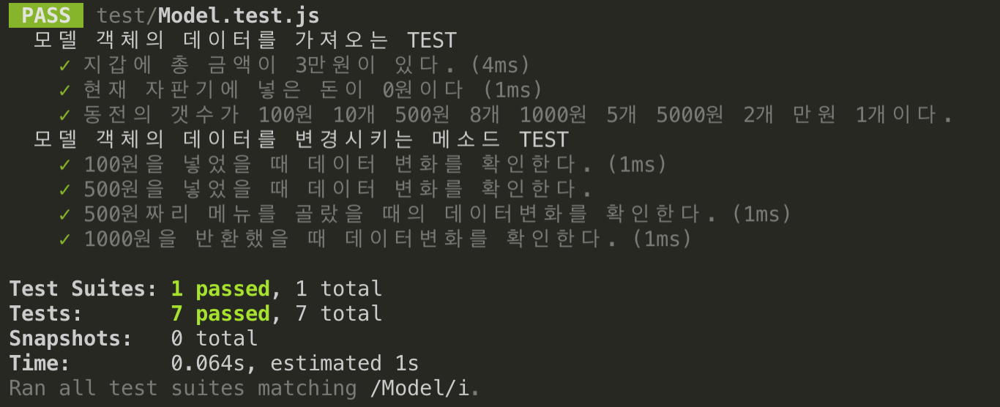
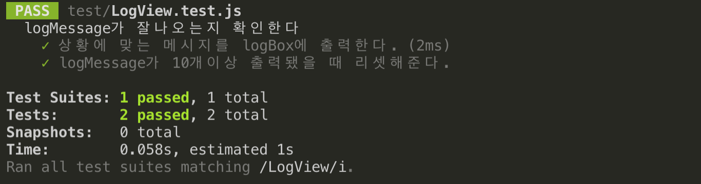
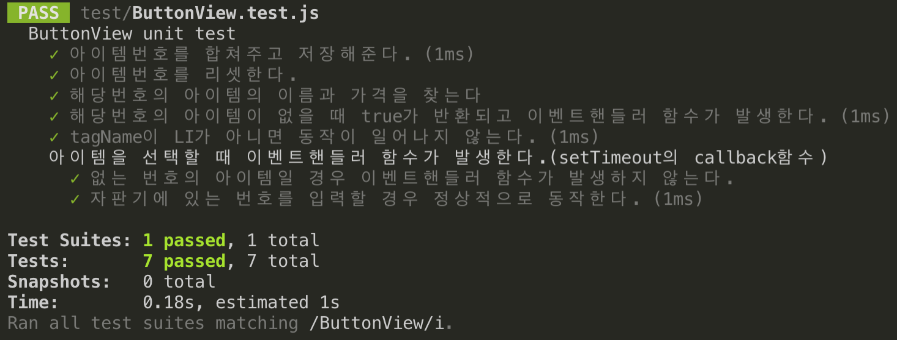
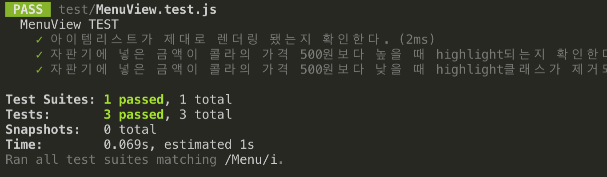
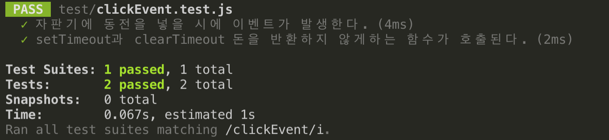

# JEST라이브러리를 사용한 MVC구조 테스트코드 경험기

처음으로 라이브러리를 사용해서 테스트코드를 경험해보았다. 진짜 UI, 비동기, event 테스트를 모두 경험해봤지만 처음이라서 그런지 몰라도 정말 너무 힘들었던 경험이였다. 하지만 힘든 경험만 있는게 아니고, 힘든만큼 유익하구나를 느꼈고 코드의 품질이 업그레이드 된다는 게 느껴져서 참으로 좋았다.

이 글에서는 어떤 코드가 테스트하기 좋은 코드이고, 테스트코드를 구현 후 리팩토링를 어떻게 했는지, 코드가 어떻게 달라졌는지 그런점에 대해서 쓰기보다는 테스트코드를 처음접했기 때문에 테스트코드 작성에 대한 로드맵같이 제시해주고 싶었다.

UI테스트를 처음하시는분이라면 분명히 도움될 꺼라고 믿는다. 마지막에는 프로젝트 테스트코드경험기를 짧게 이야기해보겠다.

## 목차

1. Demo
2. jest 설치 및 node환경설정
3. 테스트 규칙정하기
4. mock과 jest에서의 DOM
5. 웹자판기프로젝트 테스트코드 경험기

## Demo












## jest 설치 및 node 환경설정

첫번째로 Nodejs가 설치되어 있지않다면 Nodejs를 설치하자. [Nodejs](https://nodejs.org/en/) 이 링크에서 빠르게 설치할 수 있다.

이제 jest를 설치해보도록 하자.

~~~
npm init -y
npm install --save-dev jest
~~~

간략하게 설명하자면 npm init을 하면 package.json이라는 파일을 생성해준다. npm init -y를 하면 기본설정을 해준다.

`npm install`을 하면 node_modules를 설치하고 끝이고,

`npm install —save`는 package.json파일에 dependencies 객체에 설치정보를 추가해주며

`npm install --save-dev`는 devDepenencies에 객체에 설치정보를 추가해준다.

package.json정보를 봐보자.

~~~json
//package.json
"devDependencies": {
    "jest": "^23.6.0"
}
~~~

이렇게 추가가 되어있다. 이제 scripts프로퍼티에 명령어를 추가해주자.

~~~
//package.json
{	
    ...
    "scripts" : {
        "test" : "jest"
    }
}
~~~

이제 jest설치가 완료됐다. 한가지 더 설치해줘야할 것이 있다.

현재 ES6코드가 대부분이다. ES6이전코드로 트랜스파일을 해줘야할 필요가 있다.

babel이라는 라이브러리를 설치하자.

~~~js
npm install --save-dev babel-cli
npm install --save-dev babel-presets-es2015
~~~

`babel-cli` 은 command line을 통해 코드를 transplie할 수 있는 도구다.

`babel-presets-es2015`  presets을 추가하기 위해서는 npm설치가 필요하다. 

이제 설치는 모두 끝났고 마지막으로 .babelrc라는 파일을 만들고, 

~~~
{
    'presets' : [
        'es2015'
    ]
}
~~~

위 코드를 추가해준다.

만약 react를 transpile하고 싶다면 `npm install babel-presets-react` 를 해주고 presets에 react를 추가해준다.

**이로써 jest설치와 node환경세팅이 끝났다. **


## 테스트에서의 규칙정하기

1. **모든 테스트는 독립적이여야한다. **

   테스트함수를 구현하다보면 어떤기능을 실행해야하기 때문에 변수의 값 등 많은 변화가 있을 수 있다. 

   하지만 테스트함수가 동작되고 그 다음 동작될 테스트함수에 영향을 미쳐서는 안된다. 

   테스트함수가 동작되서 어떤 변화가 일어났다면 다시 변하기 전의 값으로 되돌려줘야한다. 

   그래서 보통 테스트함수내에서 새로운 객체를 생성하고 다른 테스트함수엔 또 다른 객체를 생성한다.

   하지만 일일히 선언해주면 중복되기때문에 jest에서 지원해주는 (**given의 중복이 발생한다.**)

   **beforeEach, beforeAll, afterEach, afterAll** hook메서드를 사용하면 매우 좋다. 

2. **의존하는 관계일 땐 격리시켜야한다.**

   테스트대상이 의존하는 대상이 있을 수 있다. 

   ajax나 fetch로 API를 요청하거나, UI Event, LocalStorage등 의존하는 대상을 다른 것으로 대체한다.

   이렇게 대체하는 것을 테스트더블이라고 하는데 mock, spy, stub등이 있다.

3. **given, when, then**

   테스트코드 구현할 때 모두 given, when, then방식으로 구현했다. 

   given은 사전에 준비해주는 것이다. 예를 들면 선언을 해주는 것이다. 

   when에서는 실행을 해준다. 

   then에서는 실행이 됐을 때 값을 비교해주고 테스트결과를 확인한다.

   ~~~js
   test('array test', ()=>{
       //given
       let arr = [];
       //when
       arr.push(1,2,3);
       //then
       expect(arr.length).toBe(3)
   })
   ~~~


## mock과 jest에서의 DOM

위에서 말했듯이 테스트코드를 구현할 때 독립적이고, 격리되어있어야한다. 그 테스트케이스에만 집중해야한다. 

하지만 늘 그랬듯이 생각대로 되진 않는다. 함수가 외부의 영향을 받지않고 독립적으로만 동작하면 좋지만 

외부의 영향을 받을 때도 많고, 다른 함수에 영향을 줄 때도 있다. 

우선 테스트더블을 사용하면 의존하는 대상에서 격리시킬 수 있다. 실제가 아닌 다른 것으로 대체를 하는 것이다. 


### jest에서 DOM

처음 테스트코드를 작성할 때 이것을 모르니깐 아무것도 되지가 않았다. 

만약 어떤 동작이 일어나서 해당 엘리먼트에 변화가 일어날 때 어떻게 확인할 것 인가? 

jest에서는 dom을 추가할 수 있다. 

~~~js
function getClassName(el){
    return el.className
}

const div = document.create('div');
div.classList.add('woogie');

test('엘리먼트의 클래스이름은 woogie이다', ()=>{
    const woogie = document.querySelector('.woogie');
    expect(getClassName(woogie)).toBe('woogie');
})
~~~

이렇게 되면 `const woogie = document.querySelector('.woogie')`  이런식으로 바로 엘리먼트에 접근할 수 도 있다. 만약 어떤 동작으로 인해 UI가 변경될 때 className이 추가됐다고 가정하면 className을 확인하면 되는 것이다. 

개인적으로 이게 가능하다는 것을 모르고 UI테스트를 하려고 하니깐 진짜 어떻게해야할지 깜깜했다.

**jest에서는 DOM을 추가할 수 있다는 것을 명심하자.**


## 웹자판기프로젝트 테스트코드 경험기


간단하게 설명하면 이 프로젝트는 MVC패턴으로 구현하였고, Wallet에서 금액버튼을 누르면 자판기에 투입된 금액이 증가하고,

Wallet의 총액이 감소한다. 그리고 구매가능한 메뉴의 UI가 노랑색배경으로 변하게 되고, Log에 메시지가 노출된다. 

이 프로젝트는 Menu, Button, Log, Wallet 4개의 ViewClass와 VmModel이라는 ModelClass, VmController라는 Class

6개의 클래스로 구성되어있다. 보시다시피 클래스간의 상호작용이 매우 활발히 일어난다. [프로젝트리뷰](./project_review.md) 는 링크를 통해 확인하자.


이젠 이 프로젝트의 테스트코드를 어떻게 작성하였는지 간단하게 설명하보겠다.

1. **각 클래스의 단위테스트를 진행**

2. **의존적인 관계일 땐 테스트더블을 사용하여 격리**

   ~~~js
   //ButtonView.js
   export default class ButtonView {
     constructor(delayTime) {
       this.itemId = "";
       this.lackItemHandler = null;
       this.selectItemHandler = null;
       this.stopReturnMoneyHandler = null;
       this.delayTime = delayTime;
       this.clickItemIdBtn();
     }
     //...
   ~~~

   constructor에 있는 null으로 정의되어있는 핸들러 봐보자. 

   이 핸들러들은 afterAction 실행은 해당 view클래스에서 해주지만, 선언은 controller에서 해준다. 

   view클래스끼리의 의존관계를 완전히 끊어줬다.

   ~~~js
   //ButtonView.test.js
   beforeEach(() => {
     buttonView = new ButtonView();
     buttonView.lackItemHandler = jest.fn();
     buttonView.selectItemHandler = jest.fn();
     buttonView.stopReturnMoneyHandler = jest.fn();
   })
   ~~~

   controller에서 선언해줘야할 핸들러함수를 mock을 사용하여 선언해준다.

   Unit 테스트를 통해서 메서드의 동작은 확인했으니, **호출이 잘됐는지**, **인자는 잘받았는지** 정도만 확인해준다

3. **이벤트테스트 & setTimeout테스트**

   **이벤트테스트**

   사전에 이벤트에 의해 일어나는 이벤트핸들러함수들을 모두 단위테스트를 모두 마쳐야한다.

   실제로 이벤트가 일어났을 때 핸들러함수의 동작하나하나를 테스트하기엔 어렵다.

   이벤트를 실행시킬 수 있는 방법이 있는데 dispatchEvent를 사용하면 된다.

   만약 click이라는 이벤트타입이 있을 때 실제 마우스로 click을 해줘야 동작이 일어나지만 

   dispatchEvent를 사용함으로써 해결할 수 있다.

   ```js
   const evt = new Event('click');
   el.dispatchEvent(evt);
   ```


   **setTimeout테스트**

   setTimeout도 같다. 콜백함수를 먼저 단위테스트를 실행해준다.

   그리고 `jest.useFakeTimers()` 라는 메서드를 사용하면, setTimeout과 clearTimeout이 호출됐는지 안됐는지에 대한 정보를 알 수 있다. 

   ```js
   test('setTimeout과 clearTimeout 돈을 반환하지 않게하는 함수가 호출된다.', () => {
   
     //given
     document.body.innerHTML = `
   	<div class="select-button">1</div>
   `
     const evt = new Event('click', { bubbles: true });
   
     //when
     jest.useFakeTimers();
     document.querySelector('.select-button').dispatchEvent(evt);
   
     //then
     expect(setTimeout).toBeCalled();
     expect(clearTimeout).toBeCalled();
   })
   ```

   이 예제를 보면 select-button의 className을 가진 엘리먼트를 클릭하면 setTimeout과 clearTimeout이 호출된다.

   콜백함수의 테스트는 따로 미리 해놓고, 호출이 잘 됐는지 정도를 확인하면된다.


## 마치면서

이번 테스트코드를 작성하면서 개인적으로 매우 힘들고 답답하고 기억이 있다. 하지만 프로그래밍이라는게 그렇지만 처음하는게 어렵지 두번세번 할때는 쉽다. 그러니깐 어떻게 하는 줄만 알면 그 다음부터는 개인의 역량인 것 같다.

개인적으로도 방법을 아니깐 어떻게 해야 될 지 머리속에 그려졌다. 우선 테스트를 하는법 이게 우선인거 같고, 테스트코드 구현을 잘하는 것은 그 나중의 개인의 역량인 것 같다. 이번의 글에서는 테스트를 하는법 위주로 쓴 것같은데 그 다음프로젝트에서는 어떤 코드가 테스트하기 좋은 코드고, 테스트코드를 통해서 리팩토링 과정을 거치고 발전한 코드품질에 대해서 쓰고 싶다. 

앞으로도 계속해서 발전하고 싶다.


이렇게 대체하는 것을 테스트더블(Dummy, Stub, Fake, Spy, Mock )이 있다.

이런 테스트더블은 jest가 아닌 다른 라이브러리에서도 볼 수 있다. 
